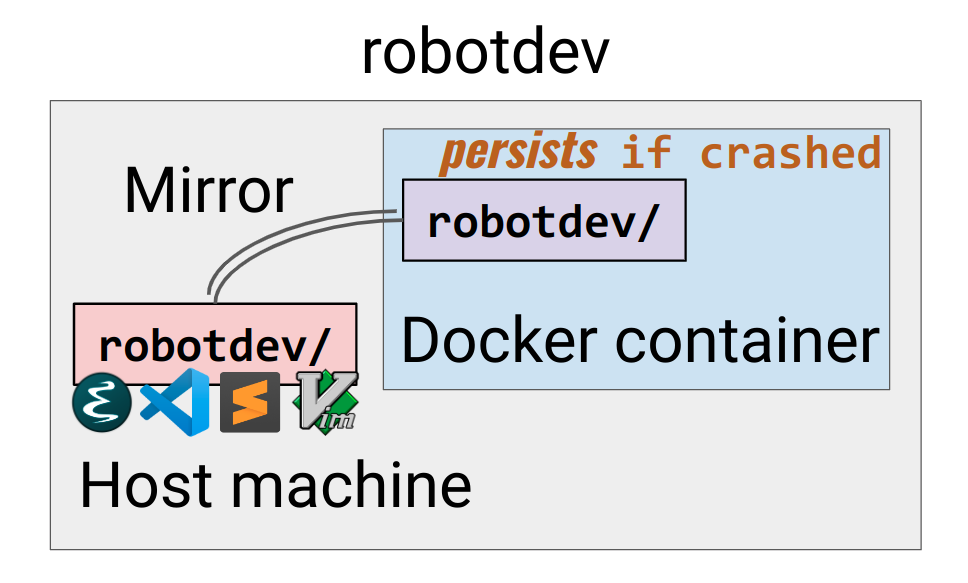

# robotdev

A homebase for robot-related development.

Watch [this Youtube tutorial on Spot development](https://youtu.be/KDvh__1Y0fI) which includes an introduction and demo of this framework [**starting at 55:17**](https://youtu.be/KDvh__1Y0fI?t=3317).


## Structure

Each robot gets a corresponding directory.  The directory is typically (at least contains)
a designated ROS workspace for that robot. The robot-specific code is maintained in
submodules (i.e. other repositories). This repository serves as the
hub for all the robot-related development efforts.


## Getting Started

1. Build the `robotdev` docker image.
   ```
   source docker/scripts/build.{version}.sh [options]
   ```
   `{version}` could be: kinetic, noetic, humble.

   `[options]` include:
   * `--hostuser={username}]`. The username inside docker
   * `--tag-suffix={tag-suffix}`. The resulting docker image will have a tag `{version}:{tag-suffix}`


2. Run the docker container
   ```
   source docker/scripts/run.{version}.sh [--gui]
   ```
   `--gui` runs the container so that GUI (X11 forwarding) is supported:


## Robot-specific setup

To setup your container for a robot, see the README file under the robot's directory (e.g .`spot`).


## Convenient Docker Utilities

To have access to convenient docker functions such as `dsh`, `dls`, etc. run
```
source docker/scripts/docker_functions.sh
```
Note that you should do this outside docker.
